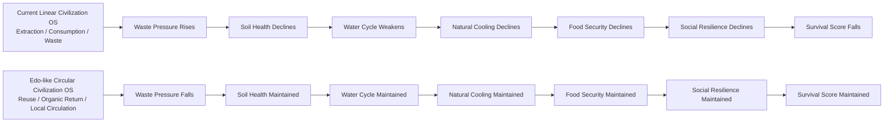

# Civilization Survival OS Comparison Simulation

## Current Civilization OS vs. Edo-like Circular Civilization OS

This simulation is a conceptual, non-predictive model for comparing the long-term survival structure of two civilizational operating systems:

1. **Current Linear Civilization OS**
2. **Edo-like Circular Civilization OS**

The purpose is not to forecast the future.  
The purpose is to visualize how the operating principles of civilization affect long-term survival, even when technology itself is highly advanced.

---

## Core Question

Can a civilization survive merely by making its technologies more precise?

This model answers: **not necessarily**.

If the underlying Civilization OS is based on extraction, consumption, waste, external dependency, and the externalization of nature, then even advanced technologies may fail to produce long-term civilizational survival.

By contrast, a circular operating structure based on reuse, organic matter return, local circulation, and ecological continuity may maintain the foundations of survival over longer time scales.

---

## Two Scenarios

### 1. Current Linear Civilization OS

The current linear model is defined by:

- Extraction
- Mass consumption
- Waste accumulation
- Weak organic matter circulation
- Soil degradation
- Water-cycle weakening
- Decline of natural cooling functions
- Increasing external dependency
- Short-term optimization

It may possess high technological capability, but its operating principles degrade the ecological and social foundations that allow civilization to persist.

### 2. Edo-like Circular Civilization OS

The Edo-like circular model is not presented as a perfect society.  
It does not endorse historical hierarchy, hardship, or technological limitation.

Instead, it extracts the structural survival logic of Edo-period circularity:

- Reuse and repair
- Mottainai spirit
- Organic matter return
- Local circulation
- Low waste pressure
- Stronger soil-water-life continuity
- Reduced external dependency
- Resilience through scale control

---

## Indicators

All indicators are represented as conceptual indices from 0 to 100.

| Indicator | Meaning |
|---|---|
| resource_base | Resource base |
| soil_health | Soil health |
| water_cycle | Water circulation |
| natural_cooling | Natural cooling capacity |
| food_security | Food security |
| social_resilience | Social resilience |
| waste_pressure | Waste pressure. Higher is worse |
| external_dependency | External dependency. Higher is worse |
| survival_score | Composite civilization survival score |

---

## Main Result

The model shows that the current linear OS begins with high capacity but loses survival score as waste pressure, external dependency, soil degradation, water-cycle decline, and natural-cooling loss accumulate.

The Edo-like circular OS does not depend on rapid growth.  
Instead, it preserves survival foundations by maintaining circularity, soil health, water circulation, and social resilience.

| Year | Current Linear OS | Edo-like Circular OS |
|---:|---:|---:|
| 0 | 70.27 | 70.27 |
| 25 | 61.46 | 77.50 |
| 50 | 45.50 | 88.62 |
| 75 | 20.32 | 93.30 |
| 100 | 0.00 | 95.04 |
| 150 | 0.00 | 96.24 |
| 200 | 0.00 | 96.83 |
| 250 | 0.00 | 97.42 |

---

## Conceptual Flow

---

## Key Interpretation

The central proposition of this model is:

**If the Civilization OS is wrong, even precise and sophisticated plans may fail to be implemented or sustained.**

Technology is not the deepest layer.  
Civilization OS determines whether technology is used for extraction, consumption, and control — or for circulation, restoration, and long-term survival.

---

## Files

- [Simulation Script](civilization_survival_os_comparison.py)
- [Results CSV](results_summary.csv)
- [Japanese README](README_ja.md)

---

## Note

This model is not a historical reconstruction or a future forecast.  
It is an educational and conceptual model for comparing the long-term survival implications of different civilizational operating principles.

---

## Author

Master / inchacomusho / InchaComisho

## Co-Created With

G (ChatGPT)

## License

CC BY 4.0
