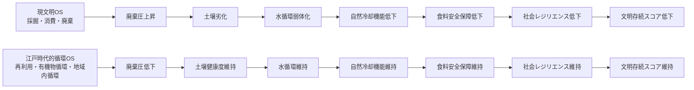

# 文明存続OS比較シミュレーション

## 現文明OSと江戸時代的循環OSの存続構造比較

このシミュレーションは、**現文明OS** と **江戸時代的循環OS** の文明存続構造を比較するための、概念的・非予測型モデルである。

目的は、未来を数値予測することではない。  
目的は、文明OSが異なると、どれほど精巧な技術や制度を持っていても、文明の存続結果が大きく変わることを可視化することである。

---

## 問題意識

文明が長期的に存続できるかどうかは、単に技術水準の高さでは決まらない。

現代文明は高度な科学技術、金融制度、通信網、都市インフラ、産業生産力を持っている。  
しかし、その文明OSが以下のような構造で動いている場合、技術の精密さは文明存続を保証しない。

- 線形消費
- 資源採掘依存
- 大量廃棄
- 有機物循環の断絶
- 土壌・水循環・自然冷却機能の外部化
- 外部依存の拡大
- 短期利益優先

一方で、江戸時代的な循環構造は、身分制度や技術制約などの問題を含むため理想化はできない。  
しかし、文明存続構造として見ると、以下の点で重要な参照モデルになる。

- もったいない精神
- 再利用・修理・再資源化
- 有機物の土壌還元
- 地域内循環
- 生活規模の制御
- 自然と人間を分断しない世界観

---

## 比較する2つの文明OS

### 1. Current Linear Civilization OS / 現文明OS

現文明OSは、成長・消費・採掘・廃棄・外部依存を前提とするモデルである。

このモデルでは、短期的な生産力や利便性は高いが、時間が経つにつれて以下の圧力が蓄積する。

- 資源基盤の劣化
- 土壌健康度の低下
- 水循環の弱体化
- 自然冷却機能の低下
- 食料安全保障の低下
- 社会レジリエンスの低下
- 廃棄圧の増加
- 外部依存の増加

### 2. Edo-like Circular Civilization OS / 江戸時代的循環OS

江戸時代的循環OSは、再利用、有機物循環、地域内循環、生活規模の抑制を重視するモデルである。

このモデルでは、急激な成長や大量消費は抑えられる。  
しかし、長期的には以下の基盤が維持されやすい。

- 土壌健康度
- 水循環
- 自然冷却機能
- 食料安全保障
- 社会レジリエンス
- 低廃棄圧
- 低外部依存

---

## 指標

このモデルでは、文明存続に関わる以下の指標を 0〜100 の指数として扱う。

| 指標 | 意味 |
|---|---|
| resource_base | 資源基盤 |
| soil_health | 土壌健康度 |
| water_cycle | 水循環 |
| natural_cooling | 自然冷却機能 |
| food_security | 食料安全保障 |
| social_resilience | 社会レジリエンス |
| waste_pressure | 廃棄圧。高いほど悪い |
| external_dependency | 外部依存。高いほど悪い |
| survival_score | 文明存続スコア |

---

## 主要結果

250年スケールで比較すると、現文明OSは初期値では高い能力を持つが、廃棄圧・外部依存・土壌劣化・水循環弱体化・自然冷却低下が重なり、存続スコアが急速に落ちる。

一方、江戸時代的循環OSは、急激な成長ではなく、循環・再利用・有機物還元・地域内レジリエンスによって、長期的な存続スコアを維持する。

| Year | Current Linear OS | Edo-like Circular OS |
|---:|---:|---:|
| 0 | 70.27 | 70.27 |
| 25 | 61.46 | 77.50 |
| 50 | 45.50 | 88.62 |
| 75 | 20.32 | 93.30 |
| 100 | 0.00 | 95.04 |
| 150 | 0.00 | 96.24 |
| 200 | 0.00 | 96.83 |
| 250 | 0.00 | 97.42 |

---

## Mermaid概念図

---

## このシミュレーションが示すこと

このモデルが示す中心命題は、次の一文に集約される。

**文明OSが正しくなければ、どれほど精巧な構想や技術を作っても、文明は長期的には実装・維持できない。**

現文明OSのままでは、技術は個別には高度化しても、文明全体としては自然基盤を削りながら動き続ける。

江戸時代的循環構造の重要性は、過去をそのまま再現することではない。  
重要なのは、文明のOSを「消費」から「循環」へ、「外部化」から「接続」へ、「短期利益」から「存続」へ書き換えることである。

---

## ファイル

- [Simulation Script](civilization_survival_os_comparison.py)
- [Results CSV](results_summary.csv)
- [English README](README.md)

---

## 注意

このモデルは、歴史再現でも未来予測でもない。  
文明OSの違いが長期存続構造に与える影響を、概念的に比較するための教育的・研究的モデルである。

---

## 著者

マスター / inchacomusho / InchaComisho

## 協力AI

G（ChatGPT）

## ライセンス

CC BY 4.0
